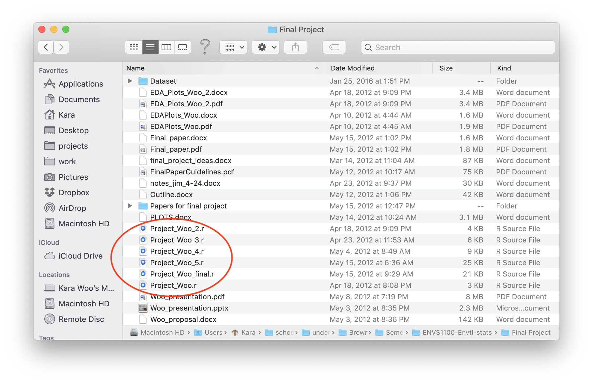

---
class: inverse, center, middle

"think of it as the 'Track Changes' features from Microsoft Word on steroids." 

-Jenny Bryan

https://happygitwithr.com/big-picture.html

---

# How it works

--

- You tell git to watch your project

--

- Git detects when things have changed

--

- You save snapshots ("commits") of your project

--

- Git lets you go back in time to any previous snapshot

---
class: center

If I had used git, I could see a record of what changed between versions of this
script.

---
# GitHub

A place to share (and collaborate on) your projects

---
# GitHub

- You work on your computer, and save snapshots of your project as you go

--

- Periodically, you share what you've done to GitHub

--

- If you're collaborating with others, then can then access your changes, and vice versa

